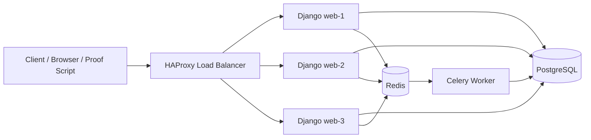

# High-Performance E-Commerce Backend Engine

## 1. Cover Page

**Project Title:** High-Performance E-Commerce Backend Engine  
**Course Area:** Parallel Programming  
**Project Type:** University Backend Performance Project  
**System Type:** Monolithic Django E-Commerce Backend  
**Implemented Report Scope:** Tasks 1-5 only  
**Main Technologies:** Python 3.11, Django, Django REST Framework, PostgreSQL, Redis, Celery, HAProxy, Docker Compose  
**Report Basis:** Actual source code, project documentation, Docker configuration, HAProxy configuration, proof scripts, and latest JSON result files under `results/`.

## 2. Abstract

This report presents the first five implemented tasks of the High-Performance E-Commerce Backend Engine. The project is a monolithic Django REST Framework backend that models a simple e-commerce workflow while demonstrating key Parallel Programming concepts: concurrent access protection, resource capacity control, asynchronous queues, batch processing, and load distribution.

The system uses PostgreSQL for durable relational data, Redis for shared coordination and Celery messaging, Celery workers for asynchronous and batch jobs, and HAProxy for distributing requests across multiple Django web containers. Proof scripts and JSON result files show that all five reported tasks passed their current validation scenarios.

## 3. Project Overview

The project implements an e-commerce backend with products, carts, checkout, orders, payments, reports, JWT authentication, performance monitoring, and simple UI pages. The project is intentionally a monolithic Django system, not a microservices system. Domain separation is achieved through Django apps:

| App | Responsibility |
| --- | --- |
| `config` | Django settings, URL routing, JWT auth URLs, Celery setup |
| `products` | Product catalog, price, stock, version field |
| `cart` | User cart and cart items |
| `orders` | Checkout, order records, order items, background task proof rows |
| `payments` | Payment records created during checkout |
| `reports` | Daily sales reports and batch processing proof rows |
| `performance` | Request timing logs, capacity metrics, health, server identity |

The first five tasks focus on correctness and measurable non-functional behavior under concurrent and distributed execution conditions.

## 4. Project Objectives

The objectives for Tasks 1-5 are:

1. Protect shared inventory data from race conditions during concurrent checkout.
2. Control checkout resource usage with a shared capacity limiter.
3. Move slow non-critical checkout work to asynchronous queues.
4. Process daily sales reports in bounded chunks through a background batch job.
5. Distribute HTTP requests across multiple backend containers using a load balancer.

The project also aims to keep core business behavior deterministic, use real proof scripts, and record measurable results in JSON files.

## 5. Technology Stack

| Layer | Technology |
| --- | --- |
| Programming language | Python 3.11 |
| Backend framework | Django |
| API framework | Django REST Framework |
| Authentication | SimpleJWT and Django default `auth.User` |
| Database | PostgreSQL |
| Shared coordination / broker | Redis |
| Async processing | Celery |
| Load balancing | HAProxy |
| API documentation | drf-spectacular Swagger/OpenAPI |
| Deployment simulation | Docker Compose |
| UI | Django templates, Bootstrap CDN, vanilla JavaScript |

## 6. System Architecture

The architecture is a Django monolith deployed as multiple identical web containers behind HAProxy. PostgreSQL and Redis are shared infrastructure services. Redis is used for Celery broker/result backend, Django cache configuration, DRF throttling support, and the checkout capacity limiter.



Key infrastructure files:

- `docker-compose.yml`
- `infra/haproxy/haproxy.cfg`
- `scripts/start_web.sh`
- `config/settings.py`

## 7. Database Design

The database stores the e-commerce state and the technical proof records used by the project.

| Table | Purpose |
| --- | --- |
| `products_product` | Product catalog with `price`, `stock`, and `version` |
| `cart_cart` | One cart per user |
| `cart_cartitem` | Products and quantities selected by a user |
| `orders_order` | Order header with user, total price, status, timestamps |
| `orders_orderitem` | Immutable checkout line items |
| `orders_orderbackgroundtask` | Persistent Celery task lifecycle proof rows |
| `payments_payment` | One payment record per order |
| `reports_dailysalesreport` | Final daily aggregate sales report |
| `reports_dailysalesbatchrun` | Technical proof for chunked batch execution |
| `performance_performancelog` | Request timing logs written by middleware |

The most important shared mutable data is `products_product.stock`. Task 1 protects this value with PostgreSQL row-level locking inside a transaction.

## 8. API Design

The API is REST-oriented and uses JWT for authenticated business operations.

| Method | Endpoint | Purpose |
| --- | --- | --- |
| `POST` | `/api/auth/register/` | Register a user and return JWT tokens |
| `POST` | `/api/auth/token/` | Login and return JWT tokens |
| `POST` | `/api/auth/token/refresh/` | Refresh access token |
| `GET` | `/api/auth/me/` | Return current authenticated user |
| `GET` | `/api/products/` | List products |
| `GET` | `/api/products/{id}/` | Product detail |
| `GET` | `/api/cart/` | Current user's cart |
| `POST` | `/api/cart/items/` | Add item to cart |
| `PATCH` | `/api/cart/items/{id}/` | Update cart item |
| `DELETE` | `/api/cart/items/{id}/` | Delete cart item |
| `POST` | `/api/orders/checkout/` | Transactional checkout |
| `GET` | `/api/orders/` | Current user's orders |
| `GET` | `/api/orders/{id}/` | Current user's order detail |
| `POST` | `/api/reports/daily-sales/run/` | Queue daily sales batch processing |
| `GET` | `/api/reports/daily-sales/batch-runs/{id}/` | Inspect one batch run |
| `GET` | `/api/reports/daily-sales/` | List daily sales reports |
| `GET` | `/api/performance/logs/` | Admin performance logs |
| `GET` | `/api/performance/capacity/` | Admin checkout capacity metrics |
| `GET` | `/api/health/` | Health check |
| `GET` | `/api/server-info/` | Backend server identity |
| `GET` | `/api/schema/` | OpenAPI schema |
| `GET` | `/api/docs/` | Swagger UI |

## 9. AOP / Performance Monitoring

The project applies Aspect-Oriented Programming through Django middleware, specifically `performance.middleware.PerformanceLogMiddleware`.

Performance monitoring is a cross-cutting concern because request timing applies to many API and UI requests, not to one business domain only. Instead of duplicating timing code inside every API view, the middleware wraps request processing, measures elapsed time, and records the result after the response is produced.

The middleware writes records into the `performance_performancelog` table with:

- endpoint
- HTTP method
- response status code
- duration in milliseconds
- creation timestamp

The relevant monitoring and system endpoints are:

- `GET /api/performance/logs/`
- `GET /api/performance/capacity/`
- `GET /api/health/`
- `GET /api/server-info/`

This implementation matches the AOP concept because performance logging is separated from the core checkout, cart, product, and report business logic while still being applied consistently around requests.

## Lecture Mapping Table

| Project Task | Lecture Session |
| --- | --- |
| Task 1 | Session 1 Concurrent Access & Thread Safety |
| Task 2 | Session 2 Thread Management / Resource Control |
| Task 3 | Session 3 Messaging Queues & Asynchronous Processing |
| Task 4 | Session 4 Batch Processing in Parallel Environments |
| Task 5 | Session 5 Load Balancing & Scaling Strategies |

## 10. Task 1: Concurrent Access & Race Condition Protection

**University requirement:** Demonstrate safe concurrent access to shared data and prevent race conditions.

**Problem:** Many users can attempt to buy the same product at the same time. Without synchronization, two or more checkout requests could read the same stock value and oversell the product.

**Chosen solution:** The checkout flow in `orders/views.py` uses `transaction.atomic()` and PostgreSQL row-level locks through `select_for_update()`. It first locks the user's cart, then locks product rows in deterministic `id` order before validating and reducing stock. The proof script is isolated from Task 2 by sending a DEBUG-only `X-Race-Condition-Test-Capacity-Limit` header that raises the capacity limit for the race-condition proof only; production ignores this header.

**Lecture concept match:** This is a direct application of concurrent access control and thread safety. Shared mutable state is protected by database-level synchronization, so concurrent workers cannot update the same product stock independently.

**Key files:**

- `orders/views.py`
- `products/models.py`
- `cart/models.py`
- `orders/models.py`
- `payments/models.py`
- `scripts/race_condition_test.py`
- `results/race_condition/race_condition_task1_latest.json`

**Proof script:** `python scripts/race_condition_test.py`

**Latest proof result:** `results/race_condition/race_condition_task1_latest.json`, created at `2026-05-18T15:54:07`.

| Metric | Actual latest value |
| --- | ---: |
| Initial stock | 5 |
| Concurrent users | 20 |
| Quantity per user | 1 |
| Expected successful checkouts | 5 |
| Actual successful checkouts | 5 |
| Expected failed checkouts | 15 |
| Actual failed checkouts | 15 |
| Insufficient stock failures | 15 |
| Capacity rejections | 0 |
| Server errors | 0 |
| Status code counts | `201: 5`, `400: 15` |
| Error code counts | `insufficient_stock: 15` |
| Final stock | 0 |
| Successful order count | 5 |
| Total sold quantity | 5 |
| Payment count | 5 |
| Negative stock | false |
| Overselling | false |
| Passed | true |

**Conclusion:** Task 1 passed. The result proves that concurrent checkout did not produce negative stock or overselling. The 15 failed requests failed because stock was exhausted, and 0 requests failed because of `checkout_capacity_exceeded`.

## 11. Task 2: Resource Management & Capacity Control

**University requirement:** Demonstrate resource management by controlling how much parallel work the backend accepts.

**Problem:** Transaction safety alone does not protect the system from too many simultaneous checkout requests. Excessive parallel checkout work can increase database lock contention, latency, and connection pressure.

**Chosen solution:** The project uses `performance.capacity_limiter.CheckoutCapacityLimiter`, a Redis-backed active checkout counter. `orders/views.py` acquires a checkout slot before running the transaction. When the configured limit is exceeded, the API returns `429 Too Many Requests` with code `checkout_capacity_exceeded`. If Redis is unavailable, it returns `503 Service Unavailable`.

**Lecture concept match:** This implements resource control by limiting active concurrent work. Redis provides a shared counter across Django workers and containers, which matches the idea of controlling thread/process pressure with a global capacity mechanism.

**Key files:**

- `performance/capacity_limiter.py`
- `orders/views.py`
- `config/settings.py`
- `scripts/start_web.sh`
- `scripts/resource_capacity_test.py`
- `results/resource_capacity/resource_capacity_task2_latest.json`

**Proof script:** `python scripts/resource_capacity_test.py`

**Latest proof result:** `results/resource_capacity/resource_capacity_task2_latest.json`, created at `2026-05-18T15:55:27`.

| Metric | Actual latest value |
| --- | ---: |
| Configured checkout limit | 6 |
| Concurrent users | 20 |
| Initial stock | 100 |
| Quantity per user | 1 |
| Successful checkouts | 8 |
| Capacity rejected count | 12 |
| Other failed requests | 0 |
| Server errors | 0 |
| Final stock | 92 |
| Total sold quantity | 8 |
| Successful order count | 8 |
| Payment count | 8 |
| Max observed active checkouts | 6 |
| Limit respected | true |
| Concurrent overlap observed | true |
| Passed | true |

**Conclusion:** Task 2 passed. The Redis limiter respected the configured limit, observed real overlap, rejected overload cleanly, and produced no server errors.

## 12. Task 3: Asynchronous Queues

**University requirement:** Use asynchronous queues to move non-critical work outside the main request path.

**Problem:** Checkout must create the order, update stock, create payment, and clear the cart reliably. However, invoice generation and order notification can be slower and do not need to block the HTTP response.

**Chosen solution:** The project uses Celery with Redis as broker/result backend. In `orders/views.py`, `transaction.on_commit()` dispatches two Celery tasks only after the checkout transaction commits: `generate_invoice_task` and `send_order_notification_task`. `orders/tasks.py` records lifecycle states in `orders_orderbackgroundtask`.

**Lecture concept match:** This matches messaging queues and asynchronous processing. The HTTP request handles critical ACID work, while independent background workers process slower tasks through Redis/Celery.

**Key files:**

- `orders/views.py`
- `orders/tasks.py`
- `orders/models.py`
- `config/celery.py`
- `config/settings.py`
- `scripts/async_queue_test.py`
- `results/async_queues/async_queue_task3_latest.json`

**Proof script:** `python scripts/async_queue_test.py`

**Latest proof result:** `results/async_queues/async_queue_task3_latest.json`, created at `2026-05-18T11:46:38`.

| Metric | Actual latest value |
| --- | ---: |
| Checkout status | 201 |
| Checkout duration | 77.18 ms |
| Background task count | 2 |
| Successful background task count | 2 |
| Failed background task count | 0 |
| Total background duration | 2054 ms |
| Celery task IDs present | true |
| Task timestamps present | true |
| Checkout returned before tasks finished | true |
| Checkout faster than background work | true |
| Order exists | true |
| Payment exists | true |
| Stock reduced | true |
| Server error | false |
| Passed | true |

Background task names:

- `generate_invoice_task`
- `send_order_notification_task`

**Conclusion:** Task 3 passed. Checkout returned quickly while two Celery tasks completed successfully after the order was committed.

## 13. Task 4: Batch Processing

**University requirement:** Implement daily sales processing as a background batch job that processes data in chunks.

**Problem:** A daily sales report can involve many orders. Loading all orders and order items at once can create high memory usage and long blocking operations.

**Chosen solution:** `reports/tasks.py` implements `process_daily_sales_report_task` as a Celery task. It uses keyset pagination by `Order.id` and processes at most `chunk_size` orders per loop. It records chunk metadata in `reports_dailysalesbatchrun` and writes final totals to `reports_dailysalesreport`.

**Lecture concept match:** This matches batch processing in parallel environments because large work is divided into bounded chunks and executed outside the request thread by a worker process.

**Key files:**

- `reports/tasks.py`
- `reports/models.py`
- `reports/views.py`
- `reports/serializers.py`
- `reports/urls.py`
- `scripts/batch_processing_test.py`
- `results/batch_processing/batch_processing_task4_latest.json`

**Proof script:** `python scripts/batch_processing_test.py`

**Latest proof result:** `results/batch_processing/batch_processing_task4_latest.json`, created at `2026-05-18T11:48:52`.

| Metric | Actual latest value |
| --- | ---: |
| API trigger status | 202 |
| Generated test orders | 250 |
| Chunk size | 50 |
| Expected chunks | 5 |
| Actual chunks processed | 5 |
| Total orders in batch | 250 |
| Total order items | 250 |
| Total quantity sold | 750 |
| Expected total quantity sold | 750 |
| Total sales | 11355.00 |
| Expected total sales | 11355.00 |
| Total sales correct | true |
| Daily sales report created | true |
| Report totals match | true |
| Celery task ID present | true |
| Metadata chunk count | 5 |
| All chunks within chunk size | true |
| Batch status | success |
| Passed | true |

**Conclusion:** Task 4 passed. The report job processed 250 orders in five chunks of 50 and produced correct final totals.

## 14. Task 5: Load Distribution

**University requirement:** Simulate request distribution across multiple servers and explain the load-balancing strategy.

**Problem:** A single Django web container can become a bottleneck. The project must demonstrate that incoming requests can be distributed across multiple backend instances while sharing state safely.

**Chosen solution:** `docker-compose.yml` defines HAProxy plus three Django web containers: `web`, `web2`, and `web3`, exposed as `web-1`, `web-2`, and `web-3` through `SERVER_NAME`. `infra/haproxy/haproxy.cfg` uses `balance roundrobin` and health checks against `/api/health/`. The `/api/server-info/` endpoint proves which backend handled each request.

**Lecture concept match:** This matches load balancing and scaling strategies. Round Robin is appropriate because the three backend containers are homogeneous and use shared PostgreSQL and Redis state.

**Key files:**

- `docker-compose.yml`
- `infra/haproxy/haproxy.cfg`
- `performance/views.py`
- `performance/system_urls.py`
- `config/settings.py`
- `scripts/load_distribution_test.py`
- `results/load_distribution/load_distribution_task5_latest.json`

**Proof script:** `python scripts/load_distribution_test.py`

**Latest proof result:** `results/load_distribution/load_distribution_task5_latest.json`, created at `2026-05-18T11:49:07`.

| Metric | Actual latest value |
| --- | ---: |
| Load balancer URL | `http://load_balancer` |
| Strategy | Round Robin |
| Total requests | 61 |
| Successful responses | 61 |
| Failed responses | 0 |
| Backend distribution: `web-1` | 21 |
| Backend distribution: `web-2` | 20 |
| Backend distribution: `web-3` | 20 |
| Unique backend servers reached | 3 |
| All expected servers reached | true |
| Distribution reasonably balanced | true |
| Balance threshold | 15.25 |
| Min backend request count | 20 |
| Max backend request count | 21 |
| Health endpoint available | true |
| Response has server name | true |
| Passed | true |

**Conclusion:** Task 5 passed. HAProxy distributed requests across all three Django backend containers with a balanced Round Robin pattern.

## 15. Testing and Proof Results

The project includes dedicated proof scripts for each reported task. Latest JSON files exist for Tasks 1-5.

| Task | Proof script | Latest result file | Passed |
| --- | --- | --- | --- |
| Task 1 | `scripts/race_condition_test.py` | `results/race_condition/race_condition_task1_latest.json` | true |
| Task 2 | `scripts/resource_capacity_test.py` | `results/resource_capacity/resource_capacity_task2_latest.json` | true |
| Task 3 | `scripts/async_queue_test.py` | `results/async_queues/async_queue_task3_latest.json` | true |
| Task 4 | `scripts/batch_processing_test.py` | `results/batch_processing/batch_processing_task4_latest.json` | true |
| Task 5 | `scripts/load_distribution_test.py` | `results/load_distribution/load_distribution_task5_latest.json` | true |

Summary of latest proof outcomes:

| Task | Main proof outcome |
| --- | --- |
| Task 1 | 20 concurrent users attempted checkout; 5 succeeded, 15 failed because stock was exhausted, capacity rejections were 0, final stock was 0, and no overselling occurred. |
| Task 2 | 20 concurrent users were tested; max active checkouts was 6, capacity rejections were 12, and server errors were 0. |
| Task 3 | Checkout took 77.18 ms while background tasks took 2054 ms total, proving non-blocking asynchronous work. |
| Task 4 | 250 orders were processed in 5 chunks of 50, with correct total quantity and sales values. |
| Task 5 | 61 requests reached all three backend servers with distribution `web-1:21`, `web-2:20`, `web-3:20`. |

If any future result file is missing, the result table should be replaced with a clear placeholder such as: "Result must be inserted after running the proof script." In the current repository state, all five latest JSON files are present.

## 16. Demo Scenario

A concise demo for Tasks 1-5 can follow this sequence:

1. Start the Docker environment:

   ```bash
   docker compose up --build
   ```

2. Open the API documentation:

   ```text
   http://127.0.0.1:8000/api/docs/
   ```

3. Show the application flow:

   - Register or log in.
   - Browse products.
   - Add a product to the cart.
   - Run checkout.
   - View orders.

4. Run proof scripts:

   ```bash
   docker compose exec web python scripts/race_condition_test.py
   docker compose exec web python scripts/resource_capacity_test.py
   docker compose exec web python scripts/async_queue_test.py
   docker compose exec web python scripts/batch_processing_test.py
   docker compose exec web python scripts/load_distribution_test.py
   ```

5. Show monitoring and system endpoints:

   ```text
   http://127.0.0.1:8000/api/performance/logs/
   http://127.0.0.1:8000/api/performance/capacity/
   http://127.0.0.1:8000/api/health/
   http://127.0.0.1:8000/api/server-info/
   http://127.0.0.1:8404/stats
   ```

Admin authentication is required for performance logs and capacity metrics.

## 17. Limitations and Future Work

This final report intentionally covers only Tasks 1-5. The following items are future work and are not implemented or claimed in this report:

- Task 6 distributed Redis caching for product or report read endpoints.
- Stress testing with k6 or a comparable load-testing tool.
- Benchmark comparison reports between baseline and optimized versions.
- Additional database indexes based on measured query patterns.
- Production hardening, including stricter security settings and log sampling/buffering for high traffic.
- Screenshots for final presentation slides, if required by the instructor.

## 18. Conclusion

The first five tasks of the High-Performance E-Commerce Backend Engine are implemented and supported by current proof results. The project demonstrates transaction-based race condition protection, Redis-backed checkout capacity control, Celery asynchronous queues, chunked background batch processing, and HAProxy Round Robin load distribution.

The implementation remains a monolithic Django backend, but it uses shared infrastructure and parallel programming techniques to handle concurrent access, background work, and multi-container request distribution. The latest JSON result files show that Tasks 1-5 passed their proof scenarios.

## Final Checklist

| Item | Status |
| --- | --- |
| Source code exists | Yes |
| Docker Compose exists | Yes |
| AOP monitoring exists | Yes |
| Proof scripts exist | Yes |
| Latest result JSON files exist | Yes |
| Tasks 1-5 passed | Yes |
| Final report created | Yes |
